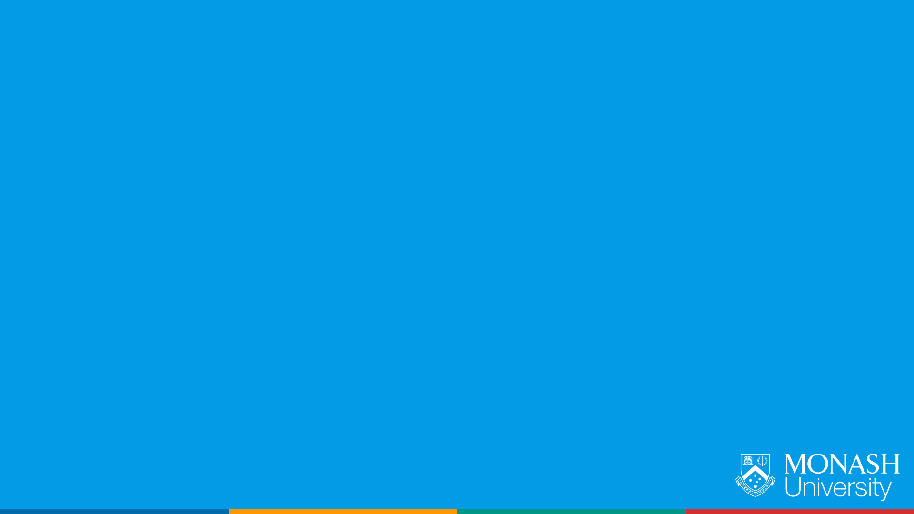
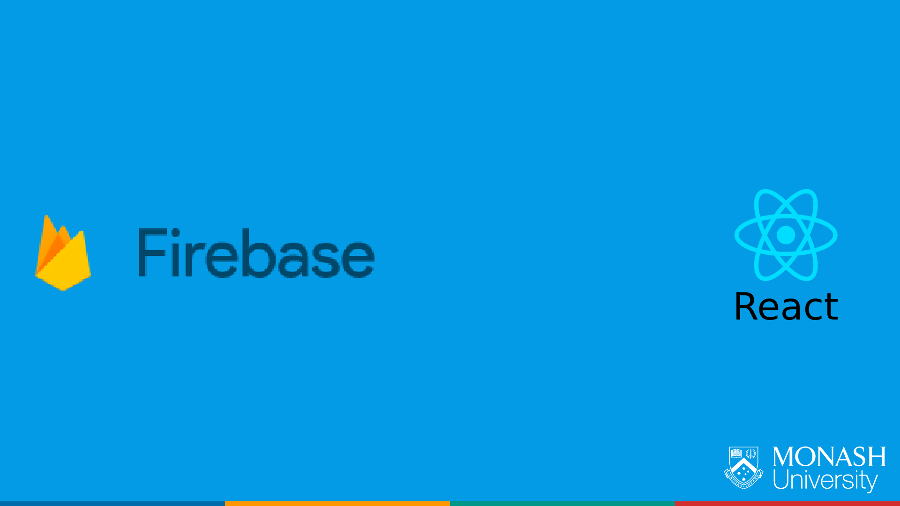

Theme: Business Class
text: Roboto, #ffffff
text-strong: Roboto Bold, #ffffff
text-emphasis: Roboto Light Italic
header: Roboto, #ffffff
header-strong: Roboto Strong,#ffffff
header-emphasis: Reklame Script, #ffffff  
code: Fira Code Medium, #EE783F, #8B3D90, #2E59A2, #DF393F, #1EA8D9
background-color: #FFFFFF  
table-separator-color: #DDDEE0
footer: **#Hackamon2018** [MONASH.EDU/STUDENTS/HACKAMON](https://monash.edu/students/hackamon) **|** 14th APRIL 2018 | Copyright Ⓒ Eric Jiang 2018
slidenumbers: false

# Getting Started at Hackathons

## Track 1: Building a MVP with Firebase and ReactJS

---

---

