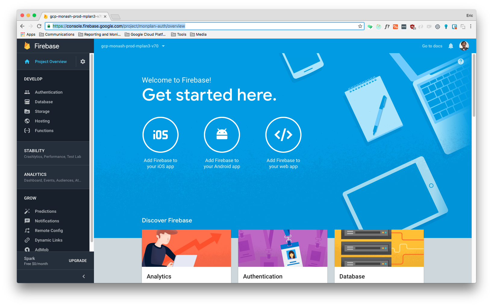

Theme: Business Class
autoscale: true
text: Roboto, #ffffff
text-strong: Roboto Bold, #ffffff
text-emphasis: Roboto Light Italic
header: Roboto, #ffffff
header-strong: Roboto Strong,#ffffff
header-emphasis: Reklame Script, #ffffff  
code: Fira Code Medium, #FFF, #FFF, #FFF, #FFF, #BBB
background-color: #FFFFFF  
table-separator-color: #DDDEE0
footer: **#Hackamon2018** [MONASH.EDU/STUDENTS/HACKAMON](https://monash.edu/students/hackamon) **|** 14th APRIL 2018 | Copyright Ⓒ Eric Jiang 2018
slidenumbers: false

# Getting Started at Hackathons

## Track 2: Building a MVP with Firebase and ReactJS


---

# Hi, I'm **Eric Jiang** 👋 <br/><br/>

* Currently, the Project Lead for [monPlan](monplan.apps.monash.edu)
* Co-founded GeckoDM and MARIE.js
* Co-founded and Pitched FutureYou to SMC, now spun that off as a seperate project
*  [@lorderikir](https://twitter.com/lorderikir)
*  https://lorderikir.me
*  eric.jiang@monash.edu
* github.com/lorderikir


---

# Prerequisites

* NodeJS (preferably with YarnPKG)
* An IDE 📝
* An Internet 🌐 Connection


---

# What is Firebase?

> Firebase is a mobile and web application development platform developed by Firebase, Inc. in 2011, then acquired by Google in 2014.
> -- Wikipedia

We are going to use Firebase Hosting in this demo


---

# What is ReactJS

ReactJS is a **component-based** that is used to build user-interfaces whether its for websites (Frontend) or hybrid (ElectronJS) applications


---

# Installing Create-React-App

CRA is a zero-configuration generator tool that can get us started up quickly

```
npm install -g create-react-app

# or if you are using yarn

yarn add -g create-react-app
```


---

# We will now create our new app.

So after we clone our git repository, we look at using create-react-app into our new directory

```
create-react-app myapp
```


---

We then go into our new directory and install all the dependencies we need

```
npm install material-ui@next react-router-dom whatwg-fetch --save

# or

yarn add material-ui@next react-router-dom whatwg-fetch
```

* We're using fetch polyfill here as `fetch` is built in natively into the browser, and it is not available for IE11 or prior
* We're also using the beta version of material-ui v1 (it will go GA Soon)


---

# Time for coding! 👨‍💻👩‍💻

## Let's build an app which users can see and search all the rooms within Monash


---

# Initialise Firebase Project



1.  Go to [console.firebase.google.com/](https://console.firebase.google.com/)
2.  Create a new project
3.  And we're good to go!


---

# Let's build a Unit Card First

```js
// src/components/RoomCard.js

import React from "react";
import { Card, CardMedia } from "material-ui";
import { CardContent } from "material-ui/Card";
import Typography from "material-ui/Typography";

export default function RoomCard({ roomCode, roomLocation, roomPicture }) {
  return (
    <Card>
      <CardMedia
        image={roomPicture}
        style={{
          height: 200
        }}
      />
      <CardContent>
        <Typography variant="subheading">{roomCode}</Typography>
        <Typography variant="title">{roomLocation}</Typography>
      </CardContent>
    </Card>
  );
}
```


---


---
